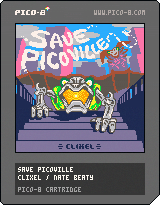

# Save Picoville

Use `load #savepicoville` in Pico 8, or play on the bbs: https://www.lexaloffle.com/bbs/?tid=54775

To learn Pico 8 I recreated (in broad strokes) one of my favorite Commodore 64 games, Save New York. My first playable version took about 10 days of work, then a few weeks of tightening things up. Still might tweak the theme music down the line as I'm currently learning that area.

I'm loving Pico 8 so far. I've been trying to get some momentum on making a game for *years*, and Pico 8 is making it fun. It reminds me of programming as a kid on C=64 and Amiga. Constraints ftw.

I find it hilarious that the original game has much better crumbling building animations. I tried several attempts at matching it, but ended up returning to my initial method, using a simple sprite cycle + a few random particles. I eventually caved in and added screen shake which helps a bit.

Extra life every 1000 points. I'm not sure if it's too easy as-is. The difficulty ramp is pretty basic.

Controls: move around, shoot (either button works)

## Changelog

v1.10
- added [one-off gfx](https://www.lexaloffle.com/bbs/?tid=49901) for custom title and about page bg
- added smoke behind plane (the code for this is hilariously bad)
- about page with points table
- new (temporary?) theme music

v1.04
- randomized supply plane position to avoid cheat spots
- persistent hi-score

v1.03
- improve player hitbox to be more lenient
- many bug fixes

v1.02
- extra life every 1000 pts
- stagger enemy animations, tweak frequency
- new sfx

v1.01
- fix train hitbox
- 2D-man now understands left + right
- much improved bullet collisions

v1.00
- initial playable version
